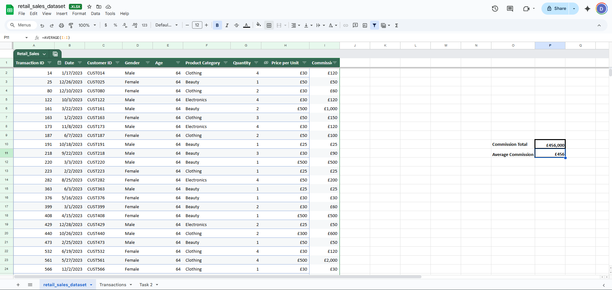

# <ins>Excel</ins>

# Introduction to Excel – data entry, analysis &amp; visualisation

## Task 1
Research and complete the following tasks within the **retail_sales_dataset.xlsx** document, paste a print screen under each task: 
 
1. In the sheet **‘retail_sales_dataset’ add** all available data between columns **A – H** into a **‘table’**

2. Using the **‘filter’** function, filter **‘Age’** to **‘largest to smallest’**

3. Using the **‘SUM’** function, show me the **commission total** in cell **‘P10’**

4. Using the **‘AVERAGE’** function, show me the **average commission** in cell **‘P11’**

