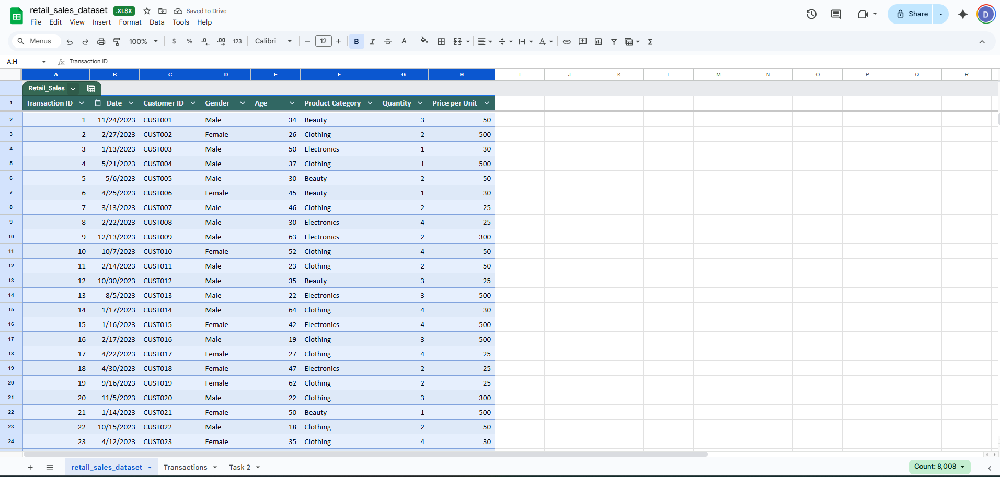
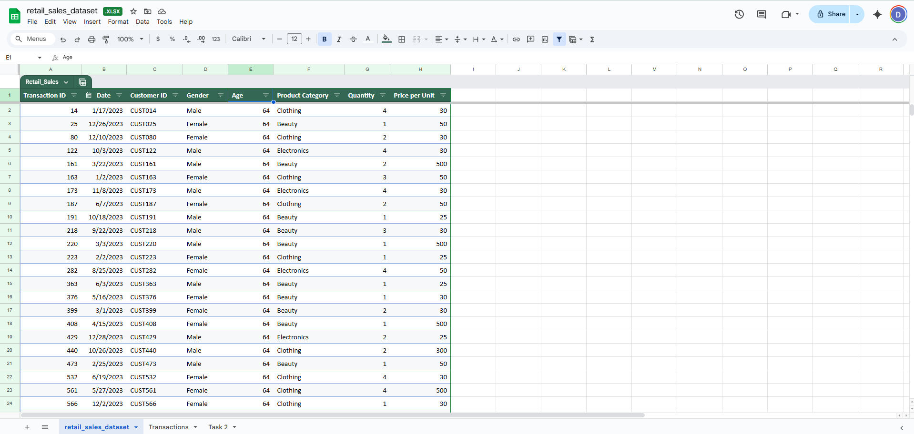
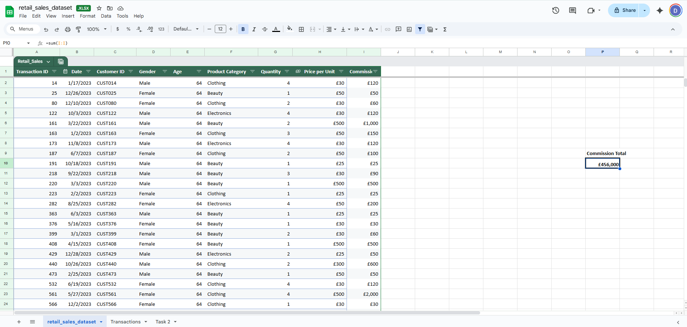
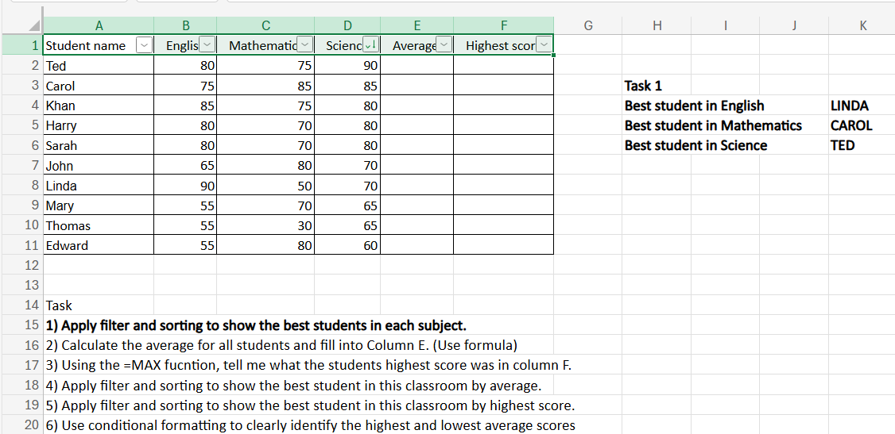
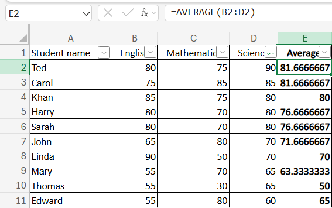
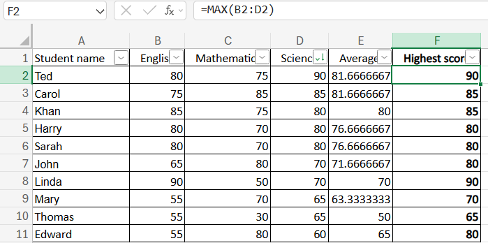
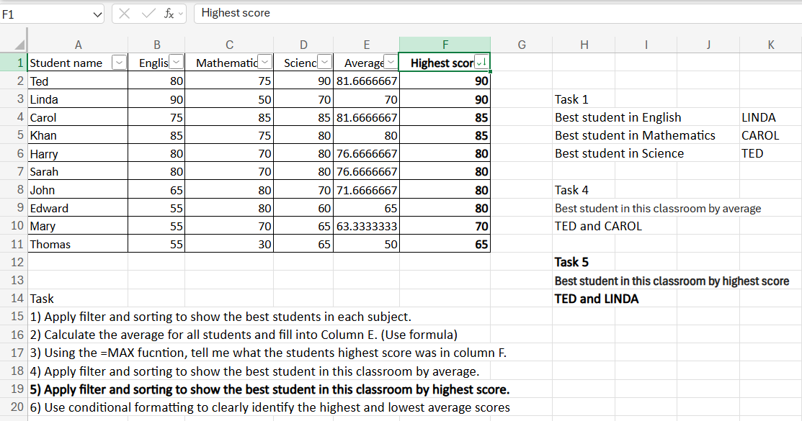
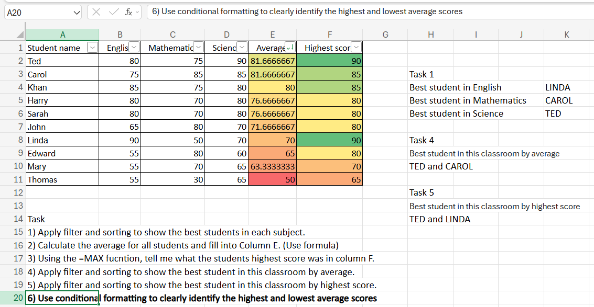

# <ins>Excel</ins>

# Introduction to Excel

As part of this project, I have explored the basic functions of Microsoft Excel.
- Convert data into table
- Filter
- Sorting
- SUM
- AVERAGE
- MAX
- Conditional Formatting

I have used the **retail_sales_dataset.xlsx** document to complete the following tasks:
 
1. In the sheet **‘retail_sales_dataset’** add all available data between columns **A – H** into a **‘table’**

2. Using the **‘filter’** function, filter **‘Age’** to **‘largest to smallest’**

3. Using the **‘SUM’** function, show me the **commission total** in cell **‘P10’**

4. Using the **‘AVERAGE’** function, show me the **average commission** in cell **‘P11’**

5. Apply **filter** and **sorting** to show the best students in each subject

6. **Calculate** the **average** for all students and fill into **Column E**

7. Using the **=MAX** function, tell me what the students highest score was in **column F**

8. Apply **filter** and **sorting** to show the best student in this classroom by **average**

9. Apply **filter** and **sorting** to show the best student in this classroom by **highest score**

10. Use **conditional formatting** to clearly identify the highest and lowest average scores

